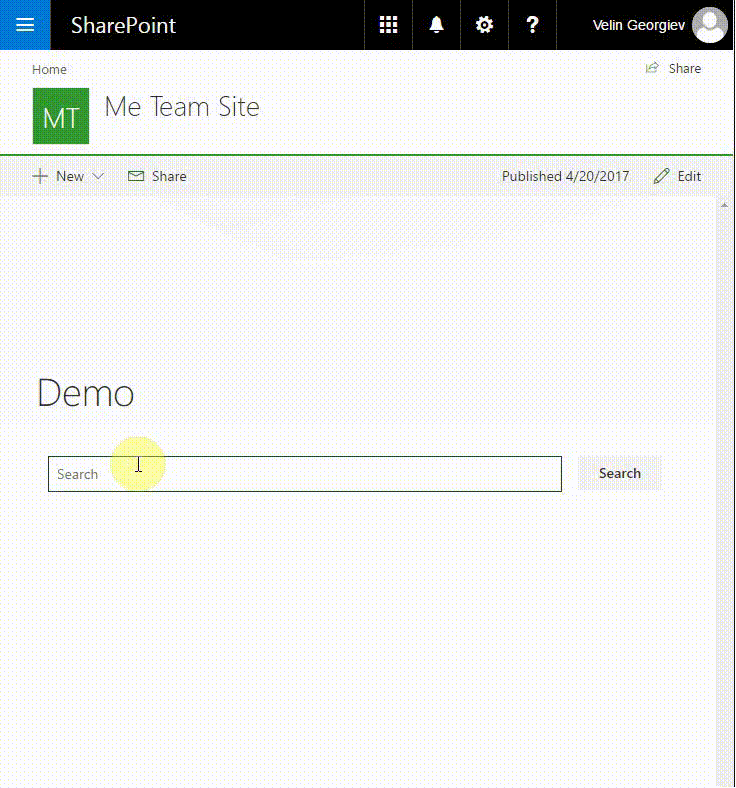
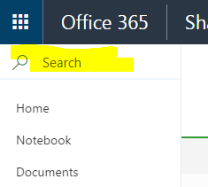
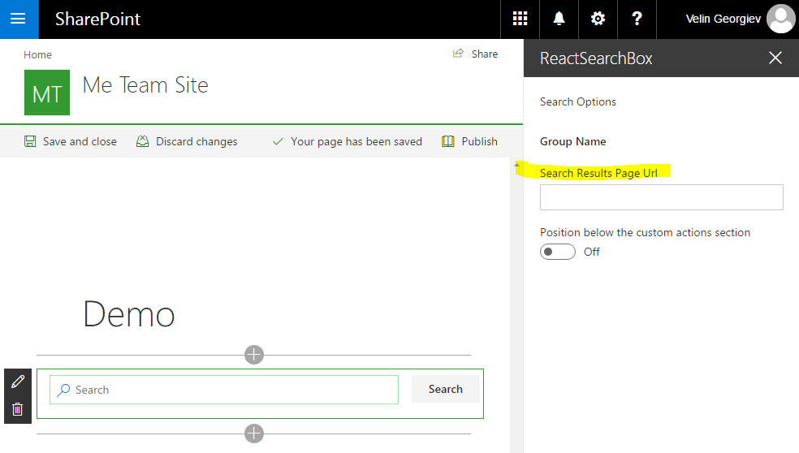
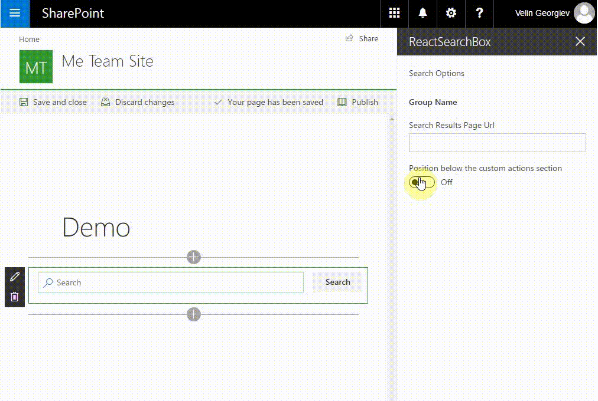

# SPFx React Search Box webpart #

## Summary

This sample contains a SharePoint Framework React Search Box webpart. The SPFx web part can be configured to point to classic search results page url and hides the OOTB modern page search box.

### Why another Search Box?

At the current moment (04.17) the default modern Site Page Search Box cannot be configured at all.

The business need is:
- Modern site page to be used as Home page.
- The search box from the modern page should show specific search results i.e. custom search results scope should be configured.

This is why I created simple SPFx search box client side web part to redirect from modern Site Page to classic search results page url where more precise search result scopes configuration can be made.

I have added another custom property so the web part can appear just below the actions pane for better user experience. This option is not recommended for production because uses page DOM manipulation and if the Office 365 team change this DOM elements on the page then it may break the webpart visibility.

## This is a temporary solution

Please note this SPFx web part can be used as temporary solution until the Office 365 team provide us with customizable search web part for the modern sitepages.

## Used SharePoint Framework Version 

## Applies to

* [SharePoint Framework](http://dev.office.com/sharepoint/docs/spfx/sharepoint-framework-overview)
* [Office 365 developer tenant](http://dev.office.com/sharepoint/docs/spfx/set-up-your-developer-tenant)

## Prerequisites

- SharePoint Framework [development environment](https://dev.office.com/sharepoint/docs/spfx/set-up-your-development-environment) already set up.

## Solution

Solution|Author(s)
--------|---------
react-search-box | Velin Georgiev ([@VelinGeorgiev](https://twitter.com/velingeorgiev))

## Version history

Version|Date|Comments
-------|----|--------
0.0.1|April 19, 2017 | Initial commit

## Disclaimer
**THIS CODE IS PROVIDED *AS IS* WITHOUT WARRANTY OF ANY KIND, EITHER EXPRESS OR IMPLIED, INCLUDING ANY IMPLIED WARRANTIES OF FITNESS FOR A PARTICULAR PURPOSE, MERCHANTABILITY, OR NON-INFRINGEMENT.**

---

## Minimal Path to Awesome

- Clone this repository.
- Open the command line, navigate to the web part folder and execute:
    - `npm i`
    - `gulp test` (optional)
    - `gulp serve --nobrowser`
- Navigate to the hosted version of the SharePoint workbench (`https://<your_tenant>.sharepoint.com/sites/<your_site>/_layouts/15/workbench.aspx`).
- Add the **SPFx React Search Box** web part.

## Features

This Web Part illustrates the following concepts on top of the SharePoint Framework:

- Using React for building SharePoint Framework client-side web parts.
- Using Office UI Fabric React styles for building user experience consistent with SharePoint and Office.
- Passing web part properties to React components.
- Passing localized strings to React components.
- Unit tests including spies, mocks and faking class methods and properties with stubs.

